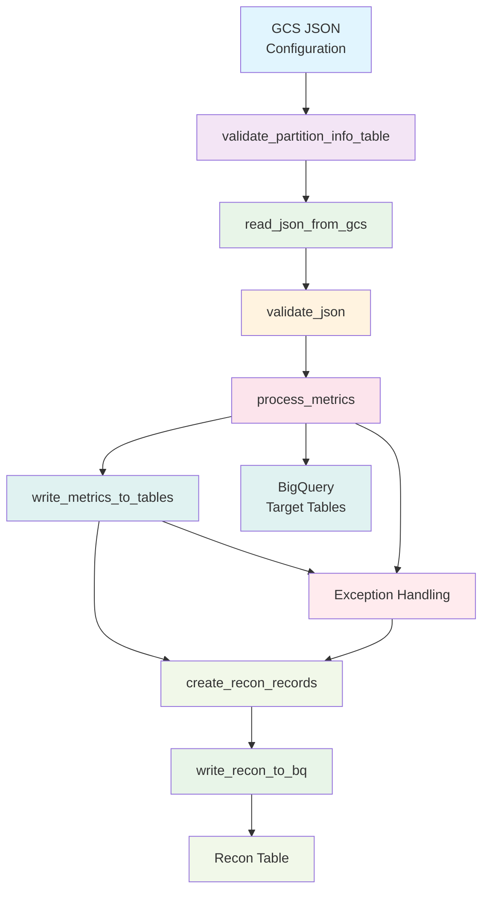

# Metrics Pipeline Framework

## Table of Contents

1. [Overview](#1-overview)
2. [Key Features](#2-key-features)
   - 2.1 [Automated Metric Processing](#21-automated-metric-processing)
   - 2.2 [Comprehensive Validation](#22-comprehensive-validation)
   - 2.3 [BigQuery Integration](#23-bigquery-integration)
   - 2.4 [Reconciliation & Audit Trail](#24-reconciliation--audit-trail)
   - 2.5 [Performance & Reliability](#25-performance--reliability)
   - 2.6 [Enterprise Features](#26-enterprise-features)
3. [Architecture Flow](#3-architecture-flow)
4. [Core Components](#4-core-components)
   - 4.1 [Pipeline Orchestrator](#41-pipeline-orchestrator-mainpy)
   - 4.2 [Metrics Pipeline](#42-metrics-pipeline-pipelinepy)
   - 4.3 [BigQuery Operations](#43-bigquery-operations-bigquerypy)
   - 4.4 [Configuration Management](#44-configuration-management-configpy)
   - 4.5 [Utility Functions](#45-utility-functions-utilspy)
   - 4.6 [Exception Handling](#46-exception-handling-exceptionspy)
5. [Technical Implementation](#5-technical-implementation)
   - 5.1 [SQL Placeholder Processing](#51-sql-placeholder-processing)
   - 5.2 [Metric Calculation Engine](#52-metric-calculation-engine)
   - 5.3 [Data Type Handling](#53-data-type-handling)
   - 5.4 [Partition Management](#54-partition-management)
6. [Input Requirements](#6-input-requirements)
   - 6.1 [JSON Configuration Schema](#61-json-configuration-schema)
   - 6.2 [Command Line Parameters](#62-command-line-parameters)
7. [Validation Features](#7-validation-features)
   - 7.1 [Input Validation](#71-input-validation)
   - 7.2 [Data Quality Validation](#72-data-quality-validation)
   - 7.3 [Schema Validation](#73-schema-validation)
8. [Error Handling & Recovery](#8-error-handling--recovery)
   - 8.1 [Exception Categories](#81-exception-categories)
   - 8.2 [Fault Tolerance Mechanisms](#82-fault-tolerance-mechanisms)
   - 8.3 [Recovery Strategies](#83-recovery-strategies)
9. [Reconciliation & Monitoring](#9-reconciliation--monitoring)
   - 9.1 [Reconciliation Record Structure](#91-reconciliation-record-structure)
   - 9.2 [Audit Trail Generation](#92-audit-trail-generation)
   - 9.3 [Performance Metrics](#93-performance-metrics)
10. [User Benefits](#10-user-benefits)
    - 10.1 [Business Users](#101-business-users)
    - 10.2 [Technical Teams](#102-technical-teams)
    - 10.3 [Data Teams](#103-data-teams)
    - 10.4 [Compliance & Audit](#104-compliance--audit)
11. [Getting Started](#11-getting-started)
12. [Configuration Examples](#12-configuration-examples)
13. [Troubleshooting](#13-troubleshooting)
14. [Support & Maintenance](#14-support--maintenance)

## 1. Overview

The Metrics Pipeline Framework is a robust, enterprise-grade data processing system built on **PySpark** and **Google BigQuery**. It automates the calculation, validation, and storage of business metrics while providing comprehensive reconciliation and error handling capabilities.

This framework is designed for organizations requiring reliable, scalable metric processing with full audit trails and data quality assurance. It handles complex SQL-based calculations, manages data dependencies, and provides complete transparency through detailed reconciliation records.

The system processes metrics in parallel, supports dynamic SQL placeholder replacement, implements comprehensive data validation, and maintains complete audit trails for regulatory compliance and operational monitoring.

## 2. Key Features

### 2.1 Automated Metric Processing
- **Parallel Processing**: Utilizes Apache Spark's distributed computing capabilities to process multiple metrics simultaneously
- **Dynamic SQL Execution**: Supports complex SQL queries with dynamic placeholder replacement for dates and partition information
- **Dependency Management**: Automatically handles metric dependencies and execution order based on configuration
- **Configurable Input**: Reads metric definitions from JSON files stored in Google Cloud Storage with full validation
- **Multi-Environment Support**: Handles different environments (DEV, BLD, PRD) with environment-specific configurations

### 2.2 Comprehensive Validation
- **Input Validation**: Validates JSON configuration files for required fields, data types, and structural integrity
- **Data Quality Checks**: Implements precision handling for decimal numbers, division by zero protection, and null value management
- **Schema Validation**: Verifies BigQuery table structures, column compatibility, and data type alignment
- **SQL Validation**: Checks SQL syntax, validates placeholder usage, and ensures query executability
- **Business Rule Validation**: Enforces business logic constraints and data consistency rules

### 2.3 BigQuery Integration
- **Native Integration**: Direct integration with Google BigQuery using the official Python client library
- **Optimized Operations**: Implements batch write operations with automatic schema alignment and overwrite capabilities
- **Query Optimization**: Includes query timeout management (180 seconds default) and resource optimization
- **Partition Awareness**: Handles partitioned tables efficiently with dynamic partition date resolution
- **Schema Management**: Automatic schema detection, validation, and alignment between source and target tables

### 2.4 Reconciliation & Audit Trail
- **Complete Tracking**: Every metric execution is tracked from input validation through final output storage
- **Detailed Records**: Creates comprehensive reconciliation records with execution status, error details, and performance metrics
- **Error Categorization**: Implements structured error classification (SQL_EXECUTION_ERROR, BIGQUERY_WRITE_ERROR, etc.)
- **Audit Compliance**: Maintains complete audit trails meeting regulatory requirements with timestamped execution logs
- **Data Lineage**: Tracks data flow from source tables through transformations to target destinations

### 2.5 Performance & Reliability
- **Fault Tolerance**: Graceful error handling with partial success capabilities and automatic recovery mechanisms
- **Resource Optimization**: Spark-based distributed processing with adaptive query execution and partition coalescing
- **Retry Logic**: Built-in retry mechanisms for transient failures with exponential backoff strategies
- **Memory Management**: Efficient memory usage with streaming processing for large datasets
- **Monitoring**: Comprehensive logging with execution tracking, performance metrics, and resource utilization monitoring

### 2.6 Enterprise Features
- **Environment Management**: Support for multiple deployment environments with environment-specific configurations
- **Configuration Management**: Centralized configuration with validation, version control, and change management
- **Security**: Implements proper authentication, authorization, and data access controls
- **Scalability**: Handles high-volume metric processing with horizontal scaling capabilities
- **Maintainability**: Modular architecture with clear separation of concerns and comprehensive documentation

## 3. Architecture Flow

The framework follows a structured 5-step process with comprehensive error handling:

1. **Configuration Input**: Reads and validates metric definitions from JSON files stored in Google Cloud Storage
2. **Validation Layer**: Performs multi-level validation including input structure, data quality, and schema compatibility
3. **Processing Engine**: Executes PySpark-based distributed processing with dynamic SQL execution and placeholder replacement
4. **Data Storage**: Writes processed metrics to BigQuery target tables with schema alignment and overwrite capabilities
5. **Reconciliation**: Creates detailed audit records with execution status, error categorization, and performance metrics

Each step includes comprehensive error handling, logging, and recovery mechanisms to ensure system reliability and data integrity.

### 3.1 System Architecture Diagram



## 4. Core Components

### 4.1 Pipeline Orchestrator (`main.py`)
- **Purpose**: Main application entry point and workflow coordination
- **Key Functions**:
  - Command-line argument parsing and validation
  - Spark session management with proper resource allocation
  - Step-by-step pipeline execution with error handling
  - Comprehensive logging and status reporting
  - Failure recovery and reconciliation record creation
- **Technical Details**:
  - Implements context managers for resource cleanup
  - Handles both expected and unexpected exceptions
  - Creates failure reconciliation records even when pipeline fails
  - Provides detailed execution statistics and performance metrics

### 4.2 Metrics Pipeline (`pipeline.py`)
- **Purpose**: Core business logic and metric processing engine
- **Key Functions**:
  - JSON validation and metric dependency checking
  - SQL placeholder replacement with dynamic date resolution
  - Metric calculation with numeric precision handling
  - BigQuery write operations with error handling
  - Reconciliation record generation
- **Technical Details**:
  - Processes metrics in parallel by target table
  - Implements safe decimal conversion for numeric values
  - Handles partition date resolution from partition info tables
  - Creates detailed error messages with categorization
  - Supports both successful and failed metric tracking

### 4.3 BigQuery Operations (`bigquery.py`)
- **Purpose**: Data warehouse integration and BigQuery operations
- **Key Functions**:
  - SQL query execution with timeout management
  - Table schema validation and compatibility checking
  - Data writing with overwrite and append capabilities
  - Partition info table management
  - Reconciliation record storage
- **Technical Details**:
  - Implements query result caching and optimization
  - Handles large dataset processing with streaming
  - Provides detailed error reporting for BigQuery operations
  - Supports both read and write operations with proper error handling
  - Manages BigQuery client connections and resource cleanup

### 4.4 Configuration Management (`config.py`)
- **Purpose**: System configuration, constants, and schema definitions
- **Key Components**:
  - Data schemas for metrics and reconciliation records
  - Validation rules and business logic constants
  - Spark configuration parameters
  - Error categories and message templates
- **Technical Details**:
  - Defines structured schemas using PySpark data types
  - Includes comprehensive error categorization system
  - Provides default values and configuration constants
  - Supports environment-specific configuration overrides

### 4.5 Utility Functions (`utils.py`)
- **Purpose**: Common operations and helper functions
- **Key Utilities**:
  - Date handling and format validation
  - Numeric processing with precision preservation
  - SQL placeholder detection and replacement
  - String processing and error message formatting
  - Validation utilities for data quality checks
- **Technical Details**:
  - Implements safe numeric conversion with decimal precision
  - Provides regex-based SQL placeholder detection
  - Handles various date formats and timezone conversions
  - Includes comprehensive input validation functions
  - Supports execution ID generation for tracking

### 4.6 Exception Handling (`exceptions.py`)
- **Purpose**: Structured error management and exception hierarchy
- **Exception Types**:
  - `MetricsPipelineError`: Base exception for all pipeline errors
  - `ValidationError`: Data validation and input errors
  - `SQLExecutionError`: SQL query execution failures
  - `BigQueryError`: BigQuery operation failures
  - `GCSError`: Google Cloud Storage operation failures
- **Technical Details**:
  - Provides structured error information with metric ID tracking
  - Supports error chaining and context preservation
  - Includes detailed error messages for debugging
  - Enables categorized error reporting for monitoring

## 5. Technical Implementation

### 5.1 SQL Placeholder Processing
The framework implements dynamic SQL placeholder replacement to handle date-dependent queries:

**Supported Placeholders**:
- `{currently}`: Replaced with the run_date parameter
- `{partition_info}`: Replaced with partition dates from partition info tables

**Processing Logic**:
1. **Placeholder Detection**: Uses regex patterns to identify placeholders in SQL queries
2. **Position Tracking**: Maintains placeholder positions for accurate replacement
3. **Date Resolution**: For `{partition_info}`, queries partition info tables to get appropriate dates
4. **Safe Replacement**: Replaces placeholders in reverse order to maintain position accuracy
5. **Validation**: Ensures all placeholders are properly resolved before query execution

**Example**:
```sql
SELECT COUNT(*) as metric_output, 
       SUM(amount) as numerator_value,
       COUNT(DISTINCT customer_id) as denominator_value,
       '{currently}' as business_data_date
FROM transactions 
WHERE partition_dt = {partition_info}
```

### 5.2 Metric Calculation Engine
The calculation engine processes metrics with comprehensive error handling:

**Processing Steps**:
1. **SQL Execution**: Executes transformed SQL with timeout management
2. **Result Extraction**: Extracts numeric values (metric_output, numerator_value, denominator_value)
3. **Type Conversion**: Safely converts numeric values to decimal with precision preservation
4. **Validation**: Validates calculation results for data quality issues
5. **Record Creation**: Creates structured metric records with metadata

**Numeric Handling**:
- Decimal precision preservation (38 digits, 9 decimal places)
- Division by zero protection
- Infinity and NaN detection
- Null value handling with appropriate defaults

### 5.3 Data Type Handling
The framework implements comprehensive data type management:

**Supported Types**:
- **Decimal**: High-precision numeric values with configurable scale
- **String**: Text data with encoding and length validation
- **Date**: Date values with format validation and conversion
- **Timestamp**: Precise datetime values with timezone handling
- **Integer**: Whole numbers with range validation

**Conversion Logic**:
- Safe type conversion with error handling
- Precision preservation for financial calculations
- Automatic null handling and default value assignment
- Schema alignment between source and target systems

### 5.4 Partition Management
Efficient handling of partitioned BigQuery tables:

**Features**:
- Dynamic partition date resolution from partition info tables
- Partition-aware query optimization
- Automatic partition pruning for performance
- Support for both date and timestamp partitioning schemes

## 6. Input Requirements

### 6.1 JSON Configuration Schema
The framework expects JSON configuration files with the following detailed structure:

```json
{
  "metric_id": "UNIQUE_METRIC_IDENTIFIER",
  "metric_name": "Human Readable Metric Name",
  "metric_type": "ratio|count|sum|average",
  "sql": "SELECT metric_output, numerator_value, denominator_value, business_data_date FROM table WHERE condition",
  "dependency": "dependency_group_name",
  "target_table": "project_id.dataset_name.table_name"
}
```

**Field Specifications**:
- **metric_id**: Unique identifier, alphanumeric with underscores, max 100 characters
- **metric_name**: Descriptive name for the metric, max 255 characters
- **metric_type**: Classification of metric calculation method
- **sql**: Complete SQL query returning required columns
- **dependency**: Group identifier for batch processing
- **target_table**: Fully qualified BigQuery table name

### 6.2 Command Line Parameters
Complete parameter specification for pipeline execution:

```bash
python main.py \
  --gcs_path gs://bucket/path/to/metrics.json \
  --run_date 2024-01-15 \
  --dependencies dep1,dep2,dep3 \
  --partition_info_table project.dataset.partition_info \
  --env PRD \
  --recon_table project.dataset.recon_table
```

**Parameter Details**:
- **gcs_path**: Google Cloud Storage path to JSON configuration file
- **run_date**: Processing date in YYYY-MM-DD format
- **dependencies**: Comma-separated list of dependency groups to process
- **partition_info_table**: BigQuery table containing partition information
- **env**: Environment identifier (DEV, BLD, PRD)
- **recon_table**: BigQuery table for reconciliation records

## 7. Validation Features

### 7.1 Input Validation
Comprehensive validation of input data and configuration:

- **Required Field Validation**: Ensures all mandatory fields are present and non-empty
- **Duplicate Detection**: Identifies duplicate metric IDs within configuration files
- **Format Validation**: Validates table names, dates, and identifier formats
- **SQL Syntax Checking**: Basic SQL syntax validation and placeholder verification
- **Dependency Validation**: Ensures specified dependencies exist in configuration
- **Data Type Validation**: Verifies data types match expected schemas

### 7.2 Data Quality Validation
Advanced data quality checks and corrections:

- **Numeric Precision**: Handles high-precision decimal calculations with proper rounding
- **Division by Zero**: Implements safe division with appropriate error handling
- **Date Format Validation**: Supports multiple date formats with automatic conversion
- **Null Value Handling**: Manages null values with business rule application
- **Range Validation**: Checks numeric values against expected ranges
- **Infinity Detection**: Identifies and handles infinite and NaN values
- **Character Encoding**: Validates text data for proper encoding and special characters

### 7.3 Schema Validation
Database schema compatibility and validation:

- **Table Existence**: Verifies all referenced tables exist and are accessible
- **Column Compatibility**: Checks column names, types, and constraints
- **Permission Validation**: Ensures proper read/write permissions on all tables
- **Schema Evolution**: Handles schema changes with backward compatibility
- **Partition Structure**: Validates partition schemes and key compatibility
- **Index Optimization**: Considers index usage for query performance

## 8. Error Handling & Recovery

### 8.1 Exception Categories
Structured error classification system:

- **PARTITION_VALIDATION_ERROR**: Issues with partition info table validation
- **GCS_READ_ERROR**: Google Cloud Storage access failures
- **JSON_VALIDATION_ERROR**: Configuration file validation failures
- **SQL_EXECUTION_ERROR**: SQL query execution problems
- **BIGQUERY_WRITE_ERROR**: Data writing operation failures
- **RECON_CREATION_ERROR**: Reconciliation record generation issues
- **PIPELINE_EXECUTION_ERROR**: General pipeline execution problems
- **UNKNOWN_ERROR**: Unclassified errors requiring investigation

### 8.2 Fault Tolerance Mechanisms
Comprehensive fault tolerance and resilience features:

- **Partial Success Handling**: Continues processing even when individual metrics fail
- **Graceful Degradation**: Maintains service availability during component failures
- **Error Isolation**: Prevents single metric failures from affecting others
- **Resource Cleanup**: Ensures proper cleanup of resources even during failures
- **State Recovery**: Maintains processing state for recovery operations
- **Timeout Management**: Implements appropriate timeouts for all operations

### 8.3 Recovery Strategies
Automated and manual recovery mechanisms:

- **Automatic Retry**: Implements exponential backoff for transient failures
- **Checkpoint Recovery**: Supports resuming from last successful checkpoint
- **Manual Intervention**: Provides tools for manual error resolution
- **Data Consistency**: Ensures data consistency during recovery operations
- **Rollback Capabilities**: Supports transaction rollback for failed operations
- **Monitoring Integration**: Integrates with monitoring systems for alerting

## 9. Reconciliation & Monitoring

### 9.1 Reconciliation Record Structure
Detailed reconciliation record schema and fields:

**Core Fields**:
- **module_id**: System module identifier (103 for Metrics)
- **module_type_nm**: Module type classification (Metrics)
- **source_server_nm**: Source environment identifier
- **target_server_nm**: Target environment identifier
- **rcncln_exact_pass_in**: Reconciliation status (Passed/Failed)
- **latest_source_parttn_dt**: Source data partition date
- **latest_target_parttn_dt**: Target data partition date

**Audit Fields**:
- **load_ts**: Record creation timestamp
- **schdld_dt**: Scheduled execution date
- **source_system_id**: Source system identifier (metric_id)
- **schdld_yr**: Scheduled execution year
- **Job_Name**: Job or metric name

### 9.2 Audit Trail Generation
Comprehensive audit trail creation and management:

- **Execution Tracking**: Records every step of metric processing
- **Performance Metrics**: Captures execution times and resource usage
- **Error Documentation**: Detailed error messages with stack traces
- **Data Lineage**: Tracks data flow from source to target
- **Change History**: Maintains history of configuration changes
- **User Activity**: Logs user actions and system interactions

### 9.3 Performance Metrics
Key performance indicators and monitoring metrics:

- **Processing Time**: Total and per-metric execution times
- **Success Rate**: Percentage of successfully processed metrics
- **Error Rate**: Frequency and types of errors encountered
- **Resource Utilization**: CPU, memory, and network usage
- **Data Volume**: Amount of data processed and transferred
- **Query Performance**: SQL execution times and optimization metrics

## 10. User Benefits

### 10.1 Business Users
Advantages for business stakeholders and decision makers:

- **Automated Reporting**: Reliable, scheduled metric calculation and reporting
- **Data Accuracy**: High-quality data with comprehensive validation and error checking
- **Audit Compliance**: Complete audit trails meeting regulatory requirements
- **Self-Service**: JSON-based configuration allowing business users to define metrics
- **Transparency**: Clear visibility into metric calculations and data lineage
- **Error Notification**: Immediate notification of data quality issues or processing failures

### 10.2 Technical Teams
Benefits for development and operations teams:

- **Scalable Architecture**: Distributed processing capable of handling large data volumes
- **Comprehensive Logging**: Detailed logs for troubleshooting and performance optimization
- **Modular Design**: Clean architecture enabling easy maintenance and feature additions
- **Error Handling**: Robust error management with detailed categorization and recovery
- **Performance Monitoring**: Built-in metrics for system performance and optimization
- **Development Efficiency**: Reusable components and clear separation of concerns

### 10.3 Data Teams
Advantages for data engineers and analysts:

- **Data Quality Assurance**: Multiple validation layers ensuring data accuracy and consistency
- **Flexible SQL Support**: Complex SQL queries with dynamic placeholder replacement
- **BigQuery Integration**: Native integration with enterprise data warehouse
- **Partition Optimization**: Efficient handling of partitioned tables for performance
- **Schema Management**: Automatic schema validation and alignment
- **Data Lineage**: Complete tracking of data transformations and dependencies

### 10.4 Compliance & Audit
Features supporting compliance and audit requirements:

- **Complete Audit Trail**: Comprehensive logging of all operations and decisions
- **Error Categorization**: Structured error classification for compliance reporting
- **Data Lineage Tracking**: Full visibility into data sources and transformations
- **Access Control**: Proper authentication and authorization mechanisms
- **Change Management**: Version control and change tracking for configurations
- **Regulatory Compliance**: Features supporting various regulatory requirements

## 11. Getting Started

### Basic Execution
To run the Metrics Pipeline Framework with standard parameters:

```bash
python main.py \
  --gcs_path gs://your-bucket/config/metrics.json \
  --run_date 2024-01-15 \
  --dependencies dependency1,dependency2 \
  --partition_info_table your-project.dataset.partition_info \
  --env PRD \
  --recon_table your-project.dataset.reconciliation
```

### Environment Setup
Required environment configuration and dependencies:

1. **Python Environment**: Python 3.7+ with required packages
2. **Google Cloud SDK**: Configured with appropriate permissions
3. **BigQuery Access**: Read/write permissions on target datasets
4. **Spark Configuration**: Properly configured Spark environment
5. **Network Access**: Connectivity to Google Cloud services

## 12. Configuration Examples

### Simple Metric Configuration
Basic metric definition for count calculations:

```json
{
  "metric_id": "daily_transaction_count",
  "metric_name": "Daily Transaction Count",
  "metric_type": "count",
  "sql": "SELECT COUNT(*) as metric_output, COUNT(*) as numerator_value, 1 as denominator_value, '{currently}' as business_data_date FROM transactions WHERE date = {partition_info}",
  "dependency": "daily_batch",
  "target_table": "analytics.metrics.transaction_metrics"
}
```

### Complex Ratio Metric
Advanced metric with complex calculations:

```json
{
  "metric_id": "customer_conversion_rate",
  "metric_name": "Customer Conversion Rate",
  "metric_type": "ratio",
  "sql": "SELECT ROUND(SAFE_DIVIDE(converted_customers, total_visitors) * 100, 2) as metric_output, converted_customers as numerator_value, total_visitors as denominator_value, '{currently}' as business_data_date FROM (SELECT COUNT(DISTINCT CASE WHEN converted = true THEN customer_id END) as converted_customers, COUNT(DISTINCT customer_id) as total_visitors FROM customer_activity WHERE activity_date = {partition_info})",
  "dependency": "customer_analytics",
  "target_table": "analytics.metrics.conversion_metrics"
}
```

## 13. Troubleshooting

### Common Issues and Solutions

**Issue**: SQL Execution Timeout
- **Cause**: Complex queries exceeding 180-second timeout
- **Solution**: Optimize queries, add indexes, or increase timeout configuration

**Issue**: Partition Info Table Not Found
- **Cause**: Incorrect table name or missing permissions
- **Solution**: Verify table name and ensure read permissions

**Issue**: Schema Mismatch Errors
- **Cause**: Target table schema doesn't match expected structure
- **Solution**: Update table schema or modify metric output structure

**Issue**: GCS Access Denied
- **Cause**: Insufficient permissions on Cloud Storage bucket
- **Solution**: Grant appropriate IAM roles for bucket access

### Debugging Steps
1. **Check Logs**: Review detailed execution logs for error messages
2. **Validate Configuration**: Ensure JSON configuration is valid and complete
3. **Test Connectivity**: Verify access to BigQuery and Cloud Storage
4. **Resource Monitoring**: Check system resources and quotas
5. **Permission Audit**: Verify all required permissions are granted

## 14. Support & Maintenance

### System Requirements
- **Compute**: Sufficient CPU and memory for Spark processing
- **Storage**: Adequate disk space for temporary files and logs
- **Network**: Reliable connectivity to Google Cloud services
- **Permissions**: Appropriate IAM roles for all required services

### Maintenance Tasks
- **Log Rotation**: Regular cleanup of execution logs
- **Performance Monitoring**: Ongoing monitoring of system performance
- **Configuration Updates**: Version control and testing of configuration changes
- **Security Updates**: Regular updates of dependencies and security patches
- **Backup Procedures**: Regular backup of configuration and audit data

### Monitoring and Alerting
- **Execution Monitoring**: Real-time monitoring of pipeline execution
- **Error Alerting**: Immediate notification of critical errors
- **Performance Tracking**: Ongoing performance metric collection
- **Resource Monitoring**: System resource utilization tracking
- **Data Quality Alerts**: Notification of data quality issues

For technical support, configuration assistance, or questions about metric definitions, please contact the Data Engineering team with detailed error logs and configuration information. 