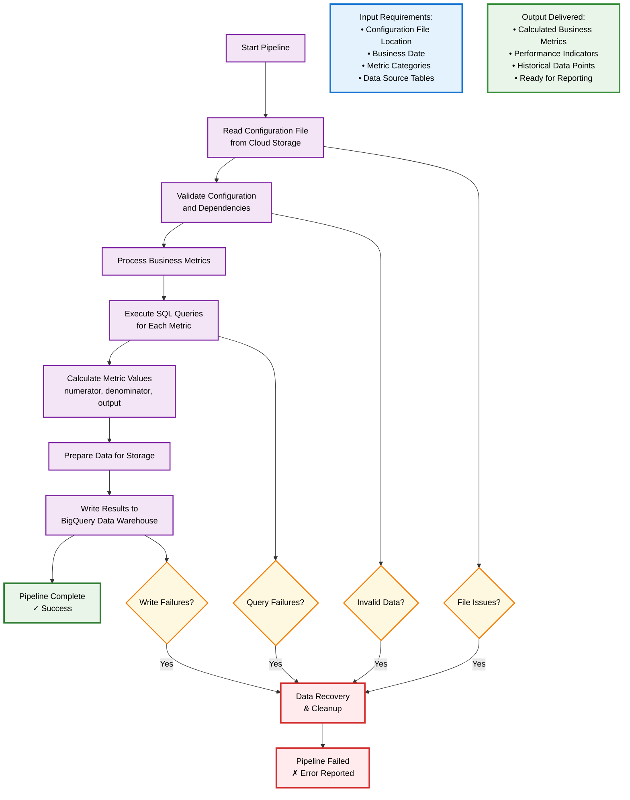

```mermaid
%%{ init: { "theme": "default", "themeVariables": { "fontSize": "16px", "fontFamily": "Arial", "primaryColor": "#ffffff", "primaryTextColor": "#000000", "tertiaryTextColor": "#000000", "textColor": "#000000" } } }%%

graph TD
    A[Start Pipeline] --> B[Read Configuration File<br/>from Cloud Storage]
    B --> C[Validate Configuration<br/>and Dependencies]
    C --> D[Process Business Metrics]
    
    D --> E[Execute SQL Queries<br/>for Each Metric]
    E --> F[Calculate Metric Values<br/>numerator, denominator, output]
    F --> G[Prepare Data for Storage]
    
    G --> H[Write Results to<br/>BigQuery Data Warehouse]
    H --> I[Pipeline Complete<br/>✓ Success]
    
    %% Error Path
    B --> J{File Issues?}
    C --> K{Invalid Data?}
    E --> L{Query Failures?}
    H --> M{Write Failures?}
    
    J -->|Yes| N[Data Recovery<br/>& Cleanup]
    K -->|Yes| N
    L -->|Yes| N
    M -->|Yes| N
    
    N --> O[Pipeline Failed<br/>✗ Error Reported]
    
    %% Input/Output Boxes
    INPUT[Input Requirements:<br/>• Configuration File Location<br/>• Business Date<br/>• Metric Categories<br/>• Data Source Tables]
    OUTPUT[Output Delivered:<br/>• Calculated Business Metrics<br/>• Performance Indicators<br/>• Historical Data Points<br/>• Ready for Reporting]
    
    %% Styling
    classDef inputStyle fill:#e3f2fd,stroke:#1976d2,stroke-width:3px
    classDef outputStyle fill:#e8f5e8,stroke:#388e3c,stroke-width:3px
    classDef processStyle fill:#f3e5f5,stroke:#7b1fa2,stroke-width:2px
    classDef successStyle fill:#e8f5e8,stroke:#2e7d32,stroke-width:3px
    classDef errorStyle fill:#ffebee,stroke:#d32f2f,stroke-width:3px
    classDef decisionStyle fill:#fff8e1,stroke:#f57c00,stroke-width:2px
    
    class INPUT inputStyle
    class OUTPUT outputStyle
    class A,B,C,D,E,F,G,H processStyle
    class I successStyle
    class N,O errorStyle
    class J,K,L,M decisionStyle
```
